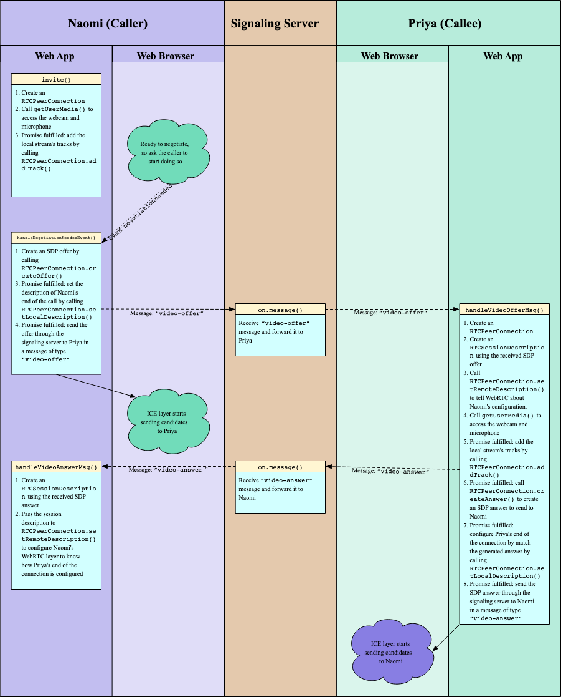

## P2P media share application
- View Demo on: 
```jsx 
https://drive.google.com/file/d/1hrEqipaMFJM5kRy_giaYAizQh8ZZHznk/view?usp=sharing
```

---

- Signaling server is implemented with WebSocket API

- Have to run the backend so that the websocket server acts as a signaling server and push the ICE-candidates to each other. 

-   can go to HOPPSCOTCH realtime section

```jsx
    https://hoppscotch.io/realtime/websocket
```

- sender start sending the media 

```jsx 
    http://localhost:5173/sender
```
- receiver recieves the media on 

```jsx 
    http://localhost:5173/receiver
```

# Whole process Summarised:



# WebRTC Jargon

## P2P protocol
WebRTC is a peer to peer protocal which allows you to send yor media to the other browser without the need of central server.

Once the connection has been established you can kill the Signalling server.

## Stun (Session Traversal Utilities for NAT)
It gives you back your publically accessable IPs. It shows you how the world sees you

```jsx 
https://webrtc.github.io/samples/src/content/peerconnection/trickle-ice/
```
Read more :
```jsx
https://datatracker.ietf.org/doc/html/draft-ietf-mmusic-trickle-ice
```

## Ice Candidates
ICE(Interactive Connectivity Establishment) - potential networking endpoints that WebRTC uses to establish the connectoin between peers.

RTCPeerConnection() - Returns a new RTCPeerConnection, representing a connection between the local device and a remote peer.

